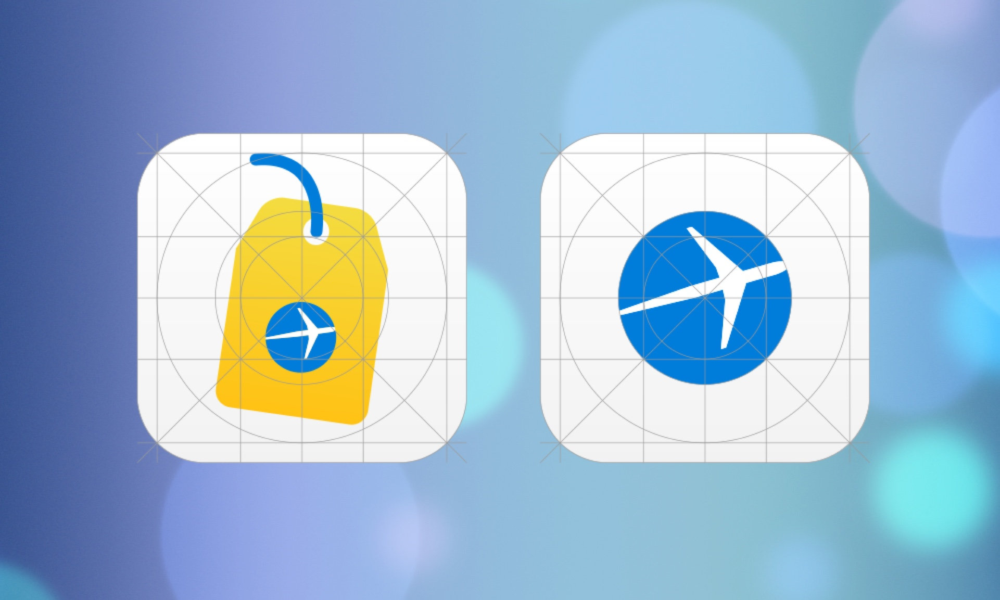
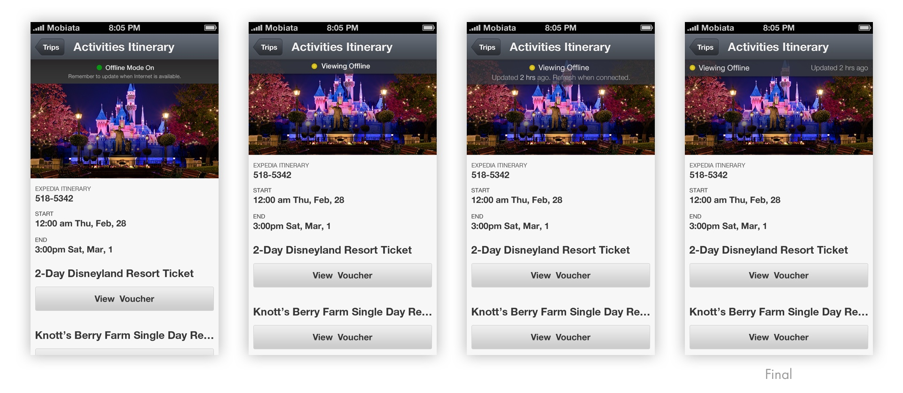
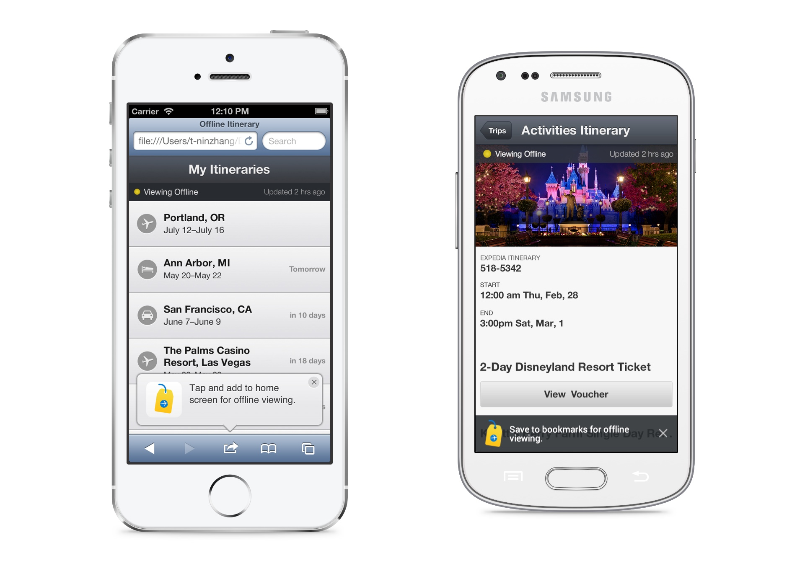

# Mobiata

### Crafting beautiful, thoughtful mobile apps that help people travel smart.

## Background

Mobiata, a startup acquired by Expedia, creates beautifully and thoughtfully designed mobile applications that help people travel smart. Their flagship apps, FlightTrack and Expedia, have received a number of accolades from the design community. In the summer of 2013, I was lucky enough to intern at Mobiata’s San Francisco office as a Mobile Designer.

## UX & Visual

In the first part of my internship, I worked on a new feature for the mobile web product — offline itinerary. During travel, often times the Internet availability is unreliable. However, travelers need a fast and reliable way to access their itineraries on the go. To meet this need, an offline itinerary viewing feature was put on the roadmap. My responsibility was to design the overall experience and collaborate with the developers and PMs to have the feature delivered.

The feature is enabled automatically, so the major part of the experience is to be informed about the state of the information. When the user is connected to the Internet, the user needs to be informed that the information has been saved, and is up-to-date. When the user is offline, the user needs to be informed that the app is not connected to the Internet, and that the information might be outdated and requires refresh when the Internet is available.

To convey these messages in a minimal and unambiguous way, we brainstormed several solutions and ended up having a message bar that contained online status indicator with the message that information is up-to-date, or offline status indicator with the message of the elapsed time since the last update. The status indicator was color-encoded to help quick understanding. More than 10 directions of visual styles were explored for the message bar.

To enable fast access, we wanted to encourage users to save the web page on the home screen like an app. For Safari browsers on iOS, we could drop a bubble with the message and an arrow pointing downwards to the “Add” button. For other browsers and Android devices, there was no universal way to save a web page to home screen. Thus a general notice was displayed. The visual style of the message was adapted to the look and feel of the platform too. To make the notice helpful but not intrusive, we made it appear only when it’s needed. It disappears after a certain amount of time, and won’t show up again if the user clicks to dismiss. I prototyped the interaction, and the animation of the notice entering and exiting using HTML and CSS.

For the home screen icons, I explored about 6 concepts before deciding to use the luggage tag to represent the idea of itinerary. Conceptually it was the closest representation. The other ideas could be easily read as maps or documents, while luggage tag signals travel on the go. At the time, iOS 7 just came out with the completely new flat design. The icons were crafted to fit in the new visual style, while retaining the branding and clarity. Similar icons were created for Android and other devices.

During the process, I learned a lot from the other designers, especially on visual design, and how the details affect the overall experience. It was also my first time to work on a feature that will be used by a substantial amount of users.

## Product Concept

My main project of the internship was to individually explore the concept of an upcoming app. I could approach the project in the way I wanted, with the support from other teams. It was not intended to be immediately put into production, so I was encouraged to explore. The project is confidential so I will only talk about the process.

I applied the human-centered design process to this project. Started with needfinding, I interviewed potential users from different demographics, understanding the current behaviors, mental models, preferences and pain points. Then I mapped out the cohorts and synthesized the insights that will inform the following design decisions. I also did competitive analysis of the apps in the similar domain. In several iterations of paper prototyping and testing with the interviewees in needfinding, I was able to quickly identify what worked and what didn’t. When I felt that the concept was clear and the flow made sense, I started to make mockups of higher level fidelity. In parallel, other designers were exploring branding directions of the app on other platforms. Referencing their work, I made a few more iterations on the UX and visual design. Eventually, I was able to present the concept with fleshed-out details, and the reasoning behind the major design decisions.

The project was well received within Mobiata and Expedia. The design team was inspired by my process of exploring new product concept. The real product is currently under development.

