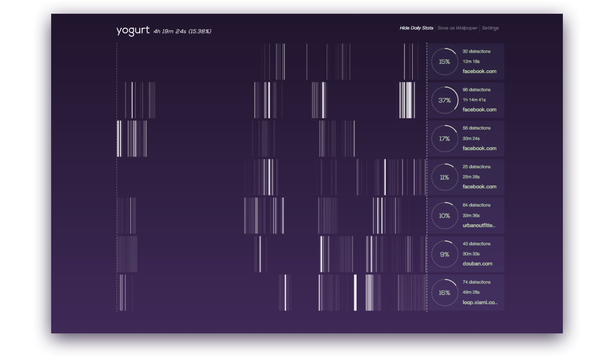
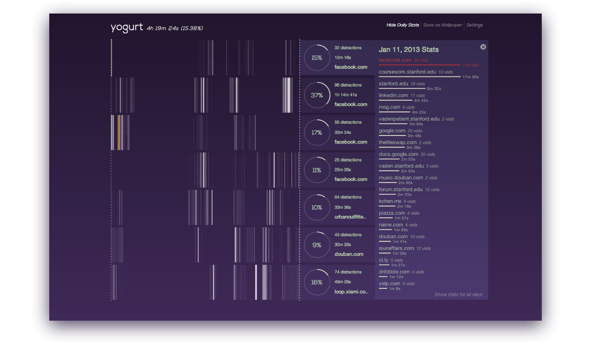
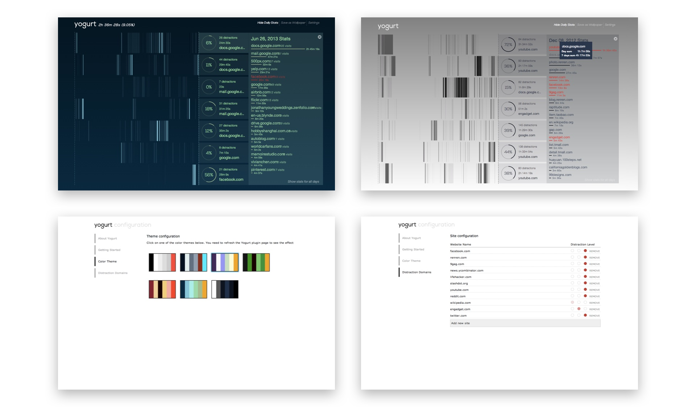

# Yogurt

### A Chrome extension that helps you understand your browsing behavior and reduce distraction.

## Motivation

I sat down to reply an email, but ended up browsing Facebook for 30 minutes. To many of us, the experience of getting distracted by irrelevant information is familiar and frustrating. We often wonder how frequent we get distracted, how much time we have spent on distractions and how we can do better. From there, we started to imagine a visualization tool that can help answer these questions.

This was originally a final project of the class [CS448 Data Visualization](https://graphics.stanford.edu/wikis/cs448b-12-fall/) taught by [Jeff Heer](http://homes.cs.washington.edu/~jheer/) at Stanford. My team also includes Borui Wang, Zheng Shen and Jianfeng Hu.

## Design

We wanted to create a browser extension that raises awareness of online distraction and foster healthy information diet, by visualizing personal browsing history in an elegant and non-intrusive way.

The main challenge is to design a visualization that surfaces patterns from fragmented temporal data, maintains details in the data segments, and interactions that support exploration. Inspired by DNA art, we invented a visualization technique that resembles barcode. We call it barcode chart.

More specifically in this project, each row represents the time period of one day, and contains a number of vertical stripes. The x-position of the stripe represents the time of the visit in the day. The brightness indicates the level of distraction, which is defined by the user. The width of the stripe represents the duration of the visit. With this visualization, it’s easy for the user to see when and how much time she spents on sites at different levels of distraction.

To help the user further understand her browsing behavior, we added daily and weekly aggregated statistics on a collapsible side pane, including a ranked list of domains sorted by visiting frequency and duration.

With interaction technique similar to Brushing and Linking, we were able to let the user explore and discover more from the data. When the user hovers a particular stripe, not only she can see more details about that visit, but all other visits of the same domain within the past seven days will also be highlighted. The same will happen when the user hovers a domain from the ranked list.

Apart from the fragmented nature, DNA art also inspired us by being highly personal. In a way, our browsing behavior is also very personal and unique to us. To add a personal touch, the user can choose from a number of color themes and export the visualization as a desktop wallpaper.

## Implementation

We used Chome’s API to detect browser events, WebSQL for data storage, D3 to implement the visualization. With some Javascript optimizations, Yogurt can render about 10k SVG stripes within 0.2 seconds, and support smooth interactions.

It was published as [an extension in the Chrome Store](https://chrome.google.com/webstore/detail/yogurt/bkcllpfdmadccnllfpkeipobfhclbjnf), but not supported anymore.

## Feedback

When Yogurt was presented at the final project fair, we received a lot of interest as well as feedback. People were generally very intrigued by the idea, and couldn’t wait to try the extension themselves. By playing with the data of my personal history in the past week, they all could see that I tended to be most productive towards midnight, then I got very distracted. I probably could have just gone to sleep.

One concern raised is that what is the reward for people trying to cut down distractions. If we define the bright stripes as bad, the ideal state would be a visualization with dull stripes, which doesn’t seem exciting or motivating. Some people might want to have bright stripes just to make the visualization interesting. In response, we think it could be better to let users define level of interests themselves, or have other types of color encoding.

Another concern is that people might forget about checking Yogurt after a while. How can we remind users right when users are spending too much time on a distraction? To maintain the non-intrusive nature, we added a subtle, ambient indicator on every webpage the user visits. The indicator shows the level of distraction, and how much time they’ve spent on this domain.

We conducted a more formal lab user testing later with 8 participants. 7 out of 8 reported that they felt more comfortable with Yogurt, compared to other similar extensions and visualizations, that the mouse interactions were effective in discovering details, and that Yogurt successfully raised the awareness of online distraction and interruption.

## Poster

As one of the most successful projects from the class, we were encouraged to submit Yogurt as a poster project to the [UIST 2013 conference](http://uist.acm.org/uist2013/). We got accepted and went to St. Andrews, Scotland to present our work. Read more about Yogurt in our paper: [Visualizing web browsing history with barcode chart](http://dl.acm.org/citation.cfm?id=2514729).

