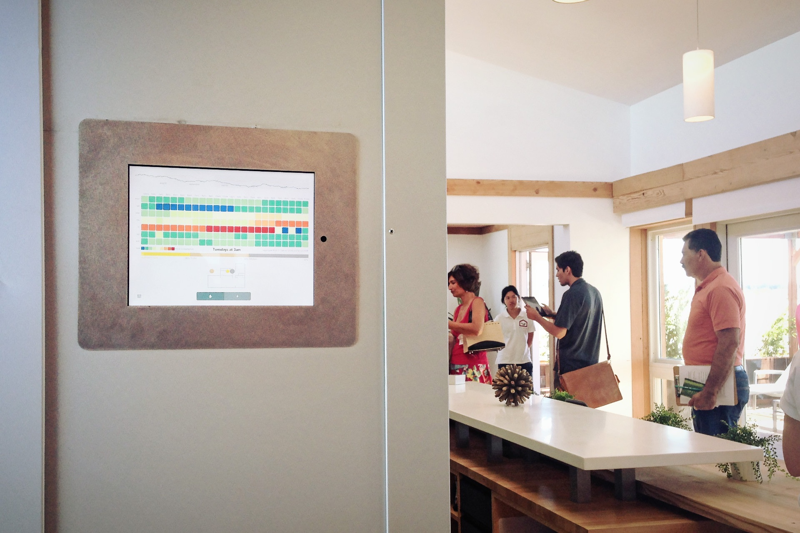
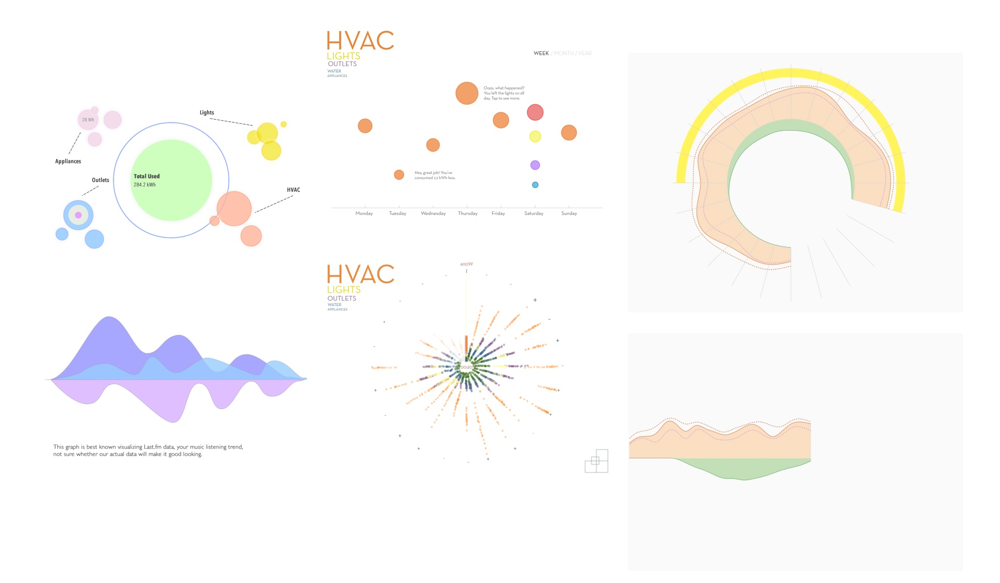
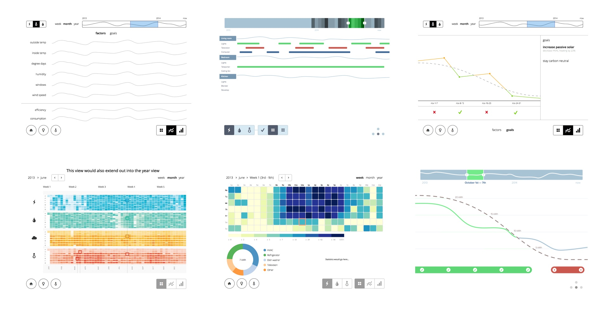
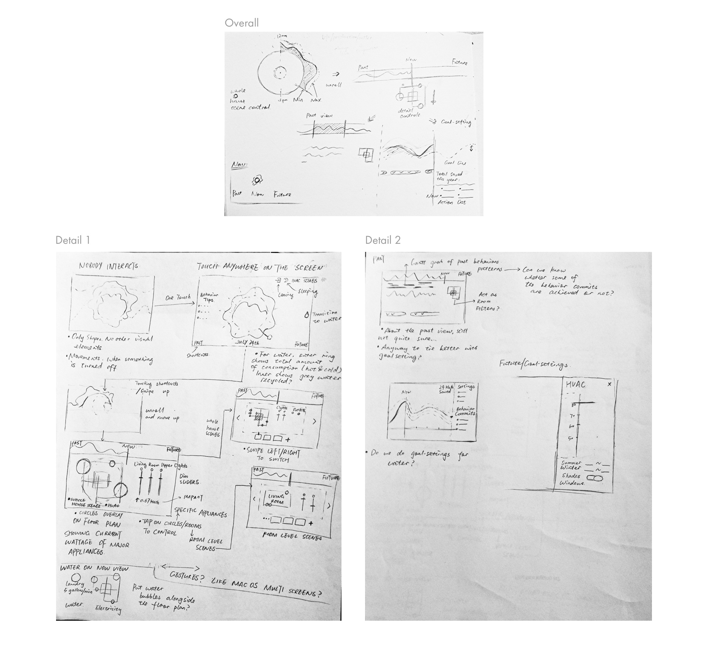
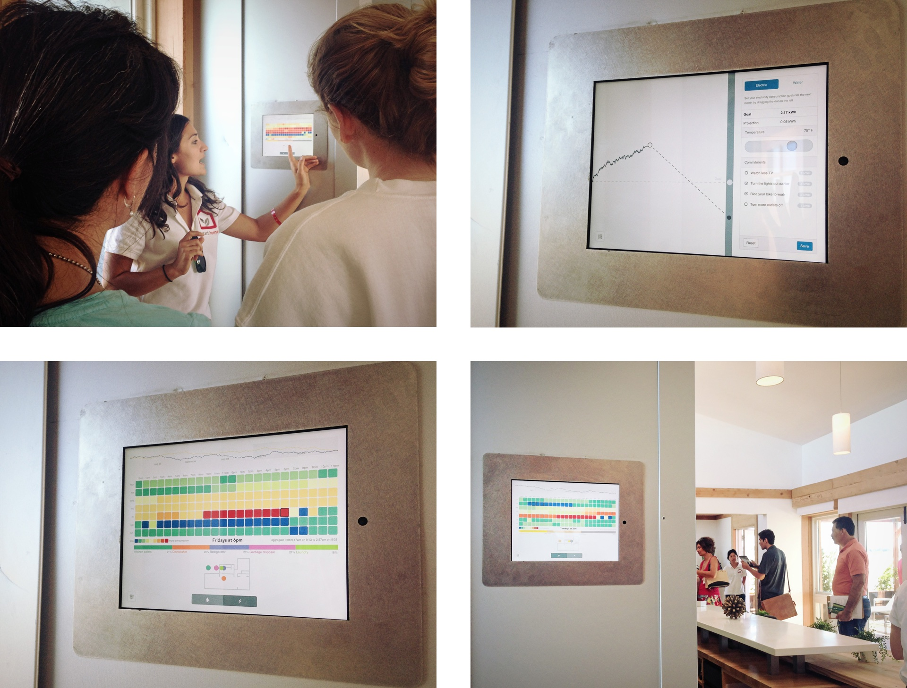

# Start.Home

### An app that integrates into a solar house to guide homeowners toward a more sustainable lifestyle.

## Background

[Start.Home](https://news.stanford.edu/features/2014/starthome/) is Stanford’s project to compete in [Solar Decathlon](http://www.solardecathlon.gov/) 2013, a global competition hosted by the US Department of Energy to promote solar technology. It was the first time for Stanford to participate. For more than one year, students across a vast range of disciplines, including architecture, engineering, construction, computer science, design and business, came together to design and build a low-cost, solar-powered home.

The vision of the project is to show how we can lead the home-building industry to a more sustainable future, and guide homeowners towards greener behavior. The team envisions that in the future, a central module that contains the major electrical, plumbing and mechanical systems can be manufactured by a factory, and then shipped to construction sites to be hooked up with a custom design. Once a new home is built, sustainable living doesn’t stop there. The home should also inspire and motivate the homeowners to develop a more sustainable lifestyle, by having designs around home that improve awareness and guide behavioral change.

To learn more about the idea of Start.Home, you can watch the [TedxStanford talk](https://www.youtube.com/watch?v=mX2rzFL9hL4) by the project lead Derek Ouyang.

I was introduced by a friend to the project. I have always been concerned with environmental problems, and curious about how designs can help shift people’s behaviors. Therefore I was immediately intrigued by the idea, and joined the Computer Science Team to develop an app, that will be primarily used on a wall-mounted display, that will help homeowners achieve the goal of a more sustainable lifestyle.

## Design

In the research phrase, a lot of information needed to be pieced together to figure out where the app fitted in the entire Start.Home project, and what exactly it should do. We reviewed the core visions and design principles for Start.Home, familiarized ourselves with the basic floor plan and major appliances in each room, and talked to other engineering teams to learn what are the technical possibilities and constraints. Meanwhile, we also found a number of related research papers on the topics of eco-sensing and eco-feedback. Most noticeably, the work by Assistant Professor [Jon Froehlich](http://www.cs.umd.edu/~jonf/), on the design of eco-feedback systems that promote environmental behaviors.

Since all the appliances and fixtures have sensors and most appliances can be controlled through software requests, both drawing insights from usage data and taking actions to control the appliances can happen within the app. From there, we started to identify the possible interactions and user stories that the app could support. The awareness starts with an ambient presence. We don’t want to get into the way of homeowners’ everyday life. The app, as displayed on the wall, will present an ambient, glance-able visualization that shows the consumption of energy and resources in the house. When the homeowner actively interacts with the app, she can quickly toggle the pre-configured modes of the house, such as leaving and sleeping; or delve into the usage data, see achievements and improvements, and how well she and other homeowners are doing in achieving the saving goals; and take immediate actions, such as turning off unused lights.

So the main components of the design are the ambient view, past data exploration, controls and goal setting.

We started with the ambient visualization design. We wanted it to look organic, artistic, and visually pleasing, while also being informative and easy to parse. In some of the explorations, we used clock on the wall as a metaphor and mapped the visualization in a ring shape. We imagined that with a tap, the ring could unwind into a linear, detailed graph, which could be a smooth transition from the ambient view to the past data exploration view.

For the past data view, the goal was to make it easy to explore the data at different levels of granularity, surface usage patterns, anomalies and improvement opportunities. The past data is also closely related to future projections and goal setting, thus we explored different ways to tie them together. The goal setting logic was one of the biggest challenge in this project. I worked with [Jason Bade](https://changelabs.stanford.edu/people/jason-bade), our consultant in behavioral science to brainstorm ideas, and evaluate different options from a theoretical standpoint. Decisions like whether there should be a default goal, if yes how the default goal should be defined, how the app should communicate when the goal is achieved or missed, when the goal should be adjusted, how we can make suggestions to help homeowners stay on their goal, took us a lot of time and discussions to reason through.

The controls were exposed both as convenient short cuts, and actions to take in goal setting. We incorporated the floor plan into the interface, so that the homeowner knows exactly which part of the house she’s controlling — an application of the [Mapping](https://en.wikipedia.org/wiki/Natural_mapping_(interface_design)) principle.

Here are the sketches of the overall design of the app:

## Execution

In the spring quarter, I collaborated with the then Computer Science Team lead [Victoria Flores](http://vicflo.github.io/), to do the research and broad concept exploration. At the beginning of summer quarter, she left and I took on the role of leading this project. I recruited a talented freshman [Austin Whittier](http://www.awhitty.me/) to join the team to do design and development. I was responsible of managing the project, tracking progress, working with the embedded system team to define APIs and data formats, collaborating with Jason, Derek and Austin to refine and iterate on the design.

In fall 2013, we took our Start.Home to Irvine, California to compete in the real competition. We scored top five in the six evaluation categories, despite being a first-time contestant.

## Reflection

This was one of the largest and most challenging projects I did at Stanford. The topic was cutting edge. The needs were not obvious. The design should not only assist, inform but also help shift behavior. The effort was highly collaborative, with multiple teams involved. The exploration space was quite large, but the resources were very constrained. I was doing it on the side while being a full-time student and full-time intern during the summer, so were other team members. It was my first time managing a months-long project, and I had to make sure it could be completed by the time the competition started.

Looking back, I wouldn’t say I’ve done a fantastic job. In the beginning, we were so excited about the topic that we spent a long time exploring and brainstorming interesting ideas. Meanwhile, it was difficult to get everyone to agree on one design. We could have gathered more feedback and moved on to the next iteration much faster. In the end we didn’t have enough time to implement a lot of the fancy ideas we aspired to do. We also could have started prototyping the integration with the embedded systems earlier. At the time it was hard to align our timelines, so the integration happened pretty near the deadline, and we had to fix a lot of unexpected problems in a rush.

