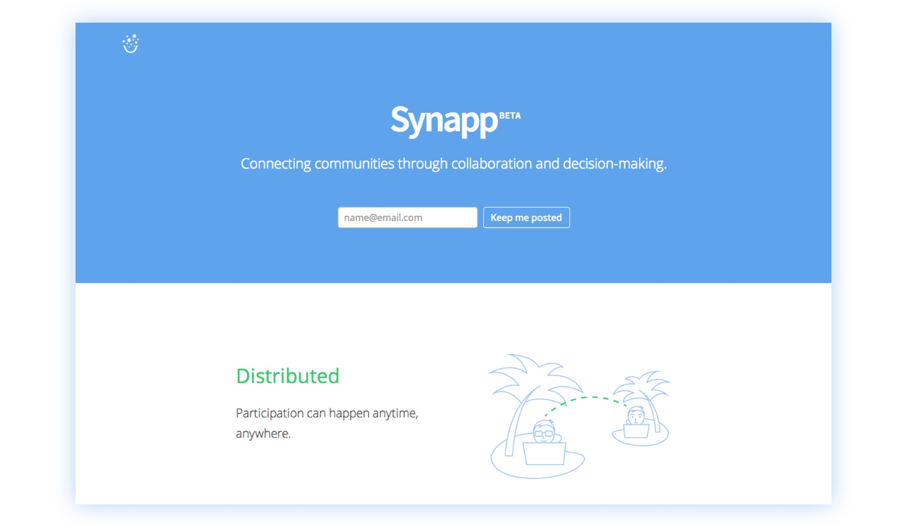
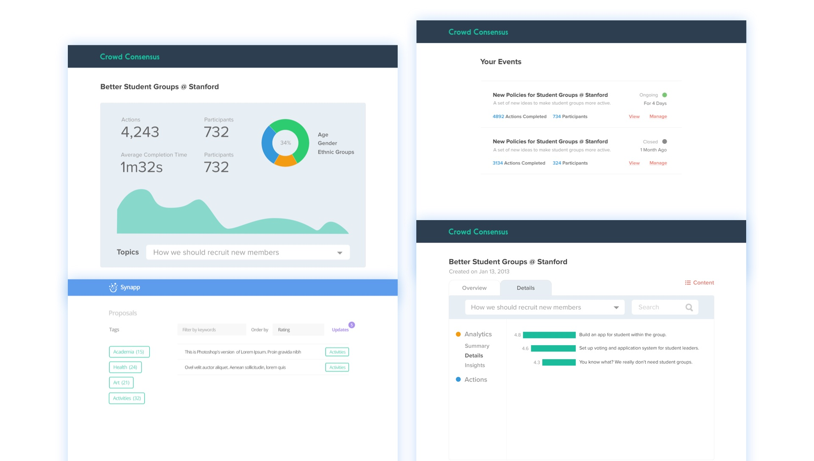
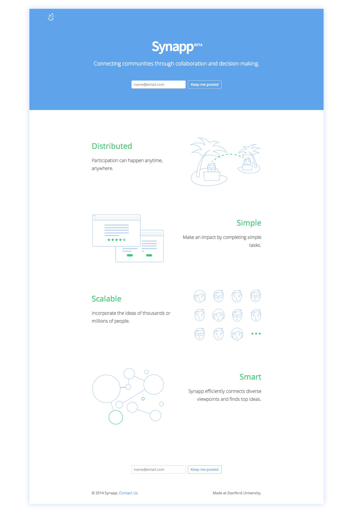
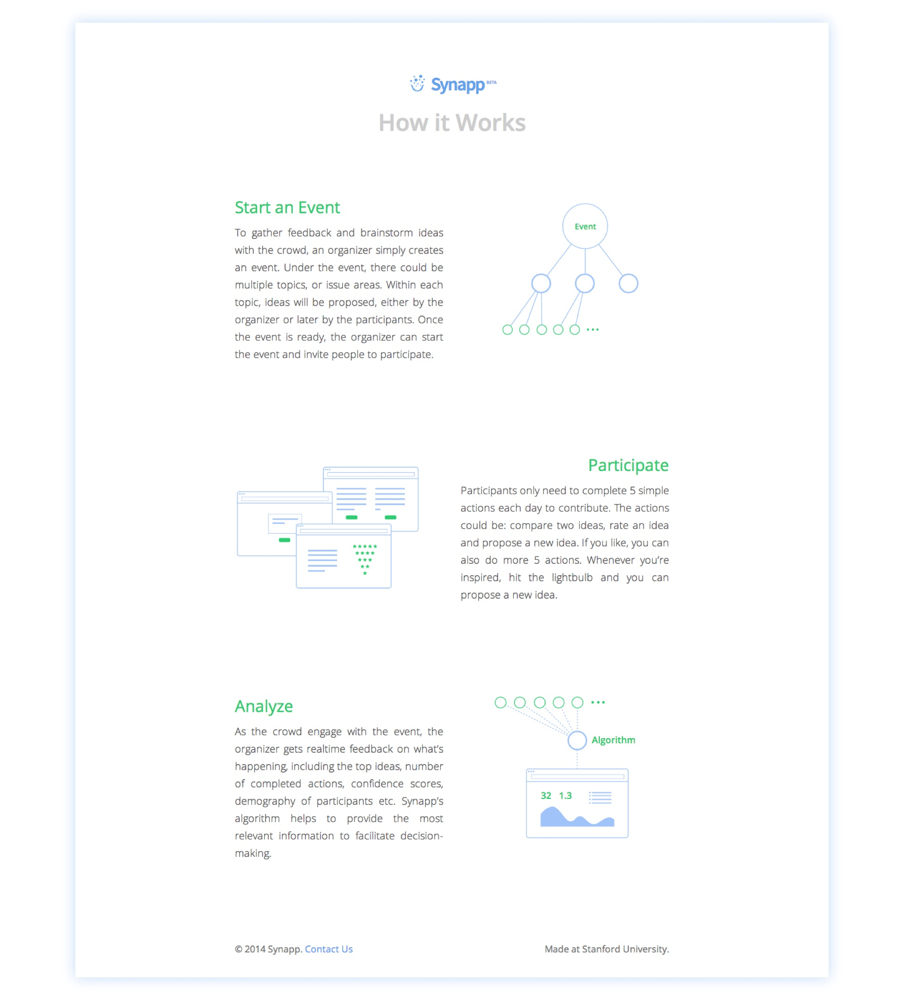

# Synapp

### A platform that enables communication and decision-making in a crowd.

## Background

[Dr. David T. Lee](http://stanford.edu/~dtlee88/index.html) was working on crowdsourced decision-making and democracy at Stanford with [Professor Ashish Goel](http://web.stanford.edu/~ashishg/). They just finished the theory formulation and the experiment with the Finland government on the off-road traffic law reform. The details can be found in this [paper](http://stanford.edu/~dtlee88/papers/hcomp-2014-cr-full.pdf).

David wanted to take the platform further, by enriching it with more features such as brainstorming, testing it with more organizations, and making it more usable as a product. I joined David and my friend Scott Cheng to make it happen.

## Design

In the very beginning, I explored concepts for admin dashboards. We wanted to make it easy for the event organizers to see at a glance how the event is going as it happens. Meaningful statistics are presented, such as how many actions participants have completed, demographic breakdown among participants etc. Proposals are the main entities on the platform where participants rank, compare, rate and create new proposals. Therefore, the dynamics of proposals as the event goes on is one important aspect to capture.

We had a lot of discussions about the design decisions involved in improving the platform. For example, to give the organizers better insights into the decisions, when a participant is prompted with an action, would it be better to add a comment section where she can express the reasons? It helps to understand the reasons behind the crowd’s decisions, but the interaction could be too heavy to encourage participation. To make the interaction more light-weight, we could pre-populate a set of keywords for the reasons, such as “impractical”, “cost-effective”. A lot of the ideas discussed at the time required more user testing to be validated.

So we started to explore the possibilities of working with Stanford student organizations. We did substantial research with student leaders to understand their current structures, workflows, and challenges. We worked with the largest student organization at Stanford — ASSU, participated in their executive meetings, introduced our platform to the executive members, and gathered a lot of feedback. To increase transparency and engagement was one of the common goals for the student leaders, and they saw a lot of potential in our platform to help them achieve that. They also raised a lot of concerns. Stanford students already receive a ton of emails every day, what would be the best way to get them to participate? The format of a short proposal could be problematic, since students are more likely to put in a problem statement or a very general solution. Similar to a group discussion, good ideas often come from building up on an existing idea. How can we incorporate the option of building on a proposal into the platform? They also helped us identify numerous problems with the platform, the biggest one being hard to construct the mental model of the terminology and understand how the platform works.

From the feedback, I’ve created illustrations, designed and implemented landing page, onboarding cards, and explanation page to help users, both event organizers and participants, understand the value proposition, and how the platform works.

Some of the illustrations were then contributed to [The Noun Project](https://thenounproject.com/ningxia/).

